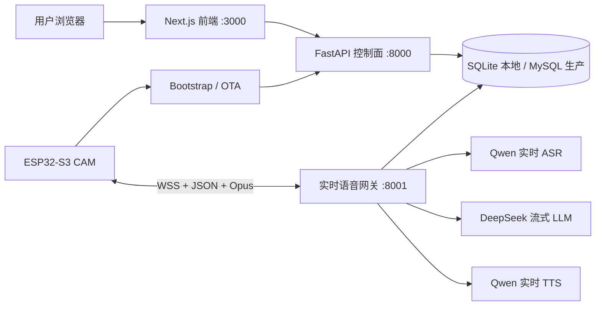

# Hensun Desk 项目入口

> 最后核对：2026-08-18。本文说明当前代码和金样机的真实状态，不代表已经量产或通过合规验收。

## 先读什么

新接手的开发者或 Agent 按下面顺序阅读：

1. [项目交接说明](../PROJECT_HANDOFF.md)：换账号或换 Agent 时使用的单文件入口。
2. 本文：产品边界、系统结构和代码入口。
3. [当前交接记录](handoffs/2026-08-18-local-golden-sample.md)：本轮聊天决策、当前工作区和下一步。
4. [聊天决策时间线](handoffs/CHAT_CONTEXT.md)：从小智官网验证到本地金样机的关键转折和已淘汰路线。
5. [本地金样机手册](runbooks/local-golden-sample.md)：启动、构建、刷机、恢复和真机验收。
6. [系统架构](specs/architecture.md)：控制面、实时网关、设备和数据边界。
7. [领域语言](../CONTEXT.md) 与 [Agent 规则](../AGENTS.md)。
8. 需要改架构时，再读 [ADR](adr/)；需要部署或工厂操作时，再读对应 [runbook](runbooks/)。

不要只看聊天记录直接改代码。聊天记录包含探索过程，本文和 ADR 才是当前约束。

## 产品是什么

Hensun Desk 是面向 18 岁以上用户的桌面 AI 助理与轻陪伴设备。当前工程样机使用 ESP32-S3 CAM、麦克风、扬声器、摄像头和 2 英寸 TFT。摄像头能力保留，但首版本地/云端对话不上传图像。

当前不包含：

- 12 岁以下儿童产品；家庭模式仍关闭。
- 支付、会员扣费、微信小程序和声纹授权。
- 电池、轮式底盘、充电座和全双工 AEC 量产结论。
- 医疗、心理治疗、虚拟恋人或真人冒充定位。

## 当前硬件基线

| 项目 | 当前值 |
|---|---|
| 开发板 | ESP32-S3 CAM，16MB Flash，8MB PSRAM |
| 板型 ID | `hensun-cam-pilot-v1` |
| 串口 | CH340/CH341；历史上曾为 `COM6`，刷写前必须重新识别 |
| 屏幕 | ST7789，物理横放后的逻辑画布为 320×240 |
| 显示 Profile | `selfhosted-landscape`：`swap_xy=true`、`mirror_x=true` |
| 音频上行 | 16kHz、单声道、60ms Opus |
| 音频下行 | 24kHz、单声道、60ms Opus |
| 唤醒 | 本地 MultiNet 命令 `ni hao xiao can`，用户文案“你好小灿” |
| BOOT | 待机时开始对话；活动时停止并进入软待机；GPIO0 仍承担下载模式 |
| 摄像头 | 代码与远程拍照保留，空闲时不持续运行 |

硬件引脚的当前来源是
`firmware/xiaozhi-esp32/main/boards/hensun/hensun-cam-pilot-v1/config.h`；屏幕尺寸和方向的来源是同目录下的 `display_profiles.json`，不要在业务代码中重复写死。

## 当前可用状态

截至 2026-08-18，本地金样机已经验证：

- `3000` 前端、`8000` 控制面、`8001` 实时网关可同时运行。
- ESP32 可以连接本机 Bootstrap/WSS，完成唤醒、ASR、LLM、TTS、播放排空和继续聆听。
- `tts.start → ready → PCM → stop → drained` 使用 `turn_id + reply_id` 关联，旧轮次不能覆盖新轮次。
- 屏幕只有在首块 PCM 真正送入扬声器时才进入说话状态。
- 当前用户已确认新的横屏说话脸和细线嘴型效果可用、动作连贯。
- 回复完成后先显示约 0.8 秒收尾，再聆听 10 秒；无人讲话才进入软睡眠。
- 语音、表情、构建安全和 CI 改动已经拆成五个独立本地提交；各提交均通过隔离的针对性测试，固件资源检查和全部主机测试也已通过。

尚未完成：

- 最新提交尚需完成全量后端/前端门禁和 ESP-IDF 三版本完整构建。
- 30 轮固定真机回归、2 小时连续运行和 8 小时待机仍需执行。
- 后端支持 10 个 `[[face:...]]` 对话标签；真机当前只有 `neutral/happy/caring` 三套独立说话脸，其余标签尚未全部变成独立真机资产。
- Staging 与公网部署暂停，先以本地金样机稳定为准。

## 系统结构



职责边界：

- `backend/app/`：账户、邮箱登录、智能体、设备、认领、配置、OTA、审计和管理 API。
- `backend/realtime/`：设备 WSS、实时 ASR、LLM/TTS 编排、播放握手、工具和表情控制。
- `web/`：客户控制台与独立权限的内部后台。
- `firmware/xiaozhi-esp32/`：上游小智 v2.4.2 快照和 Hensun 板型扩展。
- `scripts/`：本地启动、构建、刷机、契约生成、门禁、冒烟和长稳脚本。
- `migrations/`：Alembic 数据库迁移。

控制面与实时网关是两个进程，不要为了“简单”重新合并；首版也不要提前拆微服务或引入 Redis。原因见 [ADR 0001](adr/0001-control-and-realtime-processes.md)。

## 一轮语音和表情如何工作

```text
本地唤醒/BOOT
→ 设备发送 listen.start 和 Opus
→ Qwen 实时 ASR（失败时才走批量降级）
→ DeepSeek 流式回复
→ 网关剥离 [[face:emotion]]，正文进入 TTS
→ 网关发送 tts.start(reply_id, turn_id)
→ 设备准备播放并回复 ready
→ 网关按 60ms 匀速发送 Opus
→ 第一块扬声器 PCM 触发说话脸和口型
→ tts.stop
→ 解码队列和扬声器排空
→ 设备回复 drained
→ 0.8 秒收尾 → 聆听 10 秒 → 睡眠
```

关键规则：

- LLM 表情不能决定播放生命周期；真实 PCM 才能触发 `speaking`。
- 表情控制标记不得进入 TTS、聊天正文或日志。
- 一个回复最多接受两次表情变化，第二次只能在句子边界。
- 显示队列只保留最新请求，并用 generation 丢弃旧请求。
- 嘴型读取真实 PCM 包络；连续静音超过 300ms 必须闭嘴。
- `reply_id` 或 `turn_id` 不匹配的旧 ACK、旧情绪和旧停止事件全部忽略。

## 固件版本

| 构建参数 | 固件名 | 用途 |
|---|---|---|
| `official` | `hensun-cam-official-v1` | 小智官网回退版，纵屏 Profile |
| `selfhosted` | `hensun-cam-selfhosted-v1` | Hensun 自有服务，需显式 Bootstrap URL |
| `local` | `hensun-cam-selfhosted-landscape-local-v1` | 当前横屏本地金样机，多轮对话 |
| 表情实验 | `hensun-cam-emote-lab-v1` | 独立动画验证，不作为客户固件 |

官网版和自有版使用不同固件名称和 OTA 通道，禁止互相下发。摄像头和硬件引脚在两个版本中继续保留。

## 数据和安全边界

- 默认不保存原始音频或逐句对话，只保存会话元数据。
- 用户主动开启记忆后，才保存可查看、修改和删除的加密摘要。
- API Key、SMTP 授权码、设备密钥、WSS 令牌只存在本机或服务器 Secret，不进入 Git、网页构建物、固件日志和交接文档。
- 不要把 `.env`、`web/.env.local`、数据库、`run/`、构建目录或日志提交到 Git。
- 工厂设备身份写入会影响 NVS；普通应用/表情迭代不得擦除 NVS、Wi-Fi 或设备身份。

完整决策见 [ADR 0002](adr/0002-conversation-data-minimization.md) 和 [ADR 0005](adr/0005-versioned-device-and-agent-configuration.md)。

## 开发与版本控制边界

- 当前活动开发 worktree：`E:\HENSUN_STABILITY_WT`。
- 当前分支：`feature/hensun-stability-quality`。
- 禁止直接在 `E:\AI TOY\xiaozhi-claw` 修改源码；那里是另一条工作线。
- 稳定性实现已经分组提交；交接文档以及明确排除的 `design/`、设备配置迁移仍可能未提交。不要 `git reset --hard`、`git checkout -- .`、清理未跟踪文件或整批 `git add -A`。
- 每次只暂存与一个逻辑单元相关的文件，测试通过后再本地提交；除非用户明确要求，不推送、不部署、不创建 PR。

## 常用验证

在仓库根目录运行：

```powershell
$py = .\.venv\Scripts\python.exe

# 后端
& $py -m pytest backend/tests -q

# Hensun 固件主机测试
& $py -m unittest discover `
  -s firmware/xiaozhi-esp32/scripts/tests `
  -p 'test_hensun*.py'

# 源码/配置发布门禁
& $py scripts/release_gate.py

# 本地三个进程
.\scripts\start_local_pilot.ps1 -NoBrowser
.\scripts\stop_local_pilot.ps1
```

完整构建和安全刷机步骤见 [本地金样机手册](runbooks/local-golden-sample.md)。

## 下一个 Agent 的第一件事

1. 确认当前目录是 `E:\HENSUN_STABILITY_WT`，分支正确。
2. 阅读 [当前交接记录](handoffs/2026-08-18-local-golden-sample.md)。
3. 运行 `git status --short`，不要覆盖现有改动。
4. 先跑上述测试，再改代码。
5. 当前优先级是全量构建、真机刷写和长稳验收，不是新增功能、Staging 部署或继续堆表情数量。
