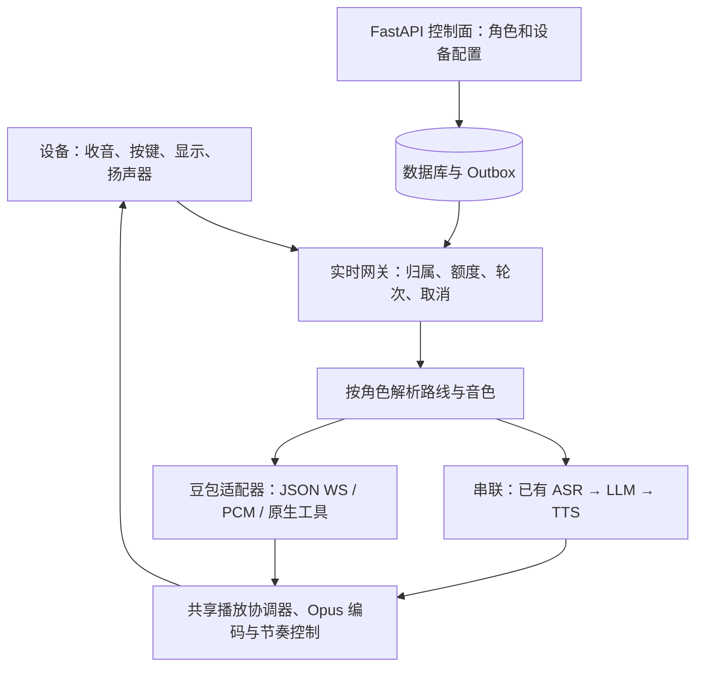

# ADR 0006：保留串联路线，增加受控的豆包实时语音路线

- 日期：2026-09-07
- 状态：架构接受；豆包实现为候选，未获整机发布放行。
- 关联：ADR 0001、0002、0005；[修订开发计划](../plans/2026-09-07-hensun-development-roadmap.md)。

## 决策

保留 FastAPI 控制面、实时网关、数据库 Outbox 与现有固件。`Agent.model_preset_id` 选择完整语音路线，`voice_preset_id` 选择兼容音色。数据库中的两个选择在一个事务内更新，并递增配置版本；当前轮冻结配置，下轮重新解析。

`ModelPreset.route_kind` 为 `cascade` 或 `realtime_s2s`。旧记录迁移为 `cascade`；S2S 只保存 `realtime_provider` 与 `realtime_model`，六个 ASR/LLM/TTS 字段为空。S2S 不能假装成三个独立模型，否则人格、轮次和成本都会错位。

## 实现边界

- `session.py` 复用单一显式/隐式开听入口、角色快照、权限与配额检查；串联使用已有 ASR/LLM/TTS 接口与 `RealtimeProviderBundle.for_models()`，配置中的模型真正进入供应商请求。
- `conversation_backend.py` 定义供应商事件与生命周期契约；`doubao.py` 实现 S2S 协议，`s2s.py` 将事件接到现有播放与计量。当前串联执行器仍在既有 `_process_turn` 中，尚未整体搬成同一事件接口的第二实现；这一搬移单列后续小批次，不能把类型声明称为完整插件化。
- 适配器由开发者随版本维护；当前目录明确开放已实现的供应商和模型。新供应商增加适配器、目录能力和契约测试。兼容协议的模型在确认能力后扩展目录，无需修改角色业务。没有公开插件市场、运行时任意模块加载或跨路线自动故障转移。
- 豆包每轮建立新上游会话，结束播放后关闭，避免旧配置、撤销记忆授权及工具权限残留。代价是每轮连接开销；只有测出瓶颈并保持同等隔离后才复用连接。
- 原串联路线的批量备用保留：首包尚未发出时可合成完整未播放前缀；首包已发出后失败明确报错，不重播整段。备用实际供应商/模型单独记账，主失败尝试与未知成本显式保留。

## 音频与生命周期

当前设备上行是 16 kHz、单声道、60 ms 裸 Opus。FFmpeg 流式解码为 16 kHz S16LE PCM，切成 20 ms 块并按采样时长上传。上行复用持续工作的设备 Opus 编码器，因此新 Ogg 包装的 pre-skip 为 0，不能每轮丢掉首部样本。解码队列上限 1 秒；通用设备输入还有帧数及字节限制。

豆包返回 24 kHz 单声道 S16LE PCM，复用既有 Opus 编码器、五包启动缓冲和 60 ms 节奏控制。输入结束、供应商 `response.done`、编码器收尾、数据发完、设备 `drained` 各自独立。没有设备 ACK 的旧客户端只有兼容等待，不能用于正式验收。

云端判停可以唤醒网关，不依赖设备再发一帧；本地 stop 与云端判停去重。取消先使供应商代次和工具任务失效，再清理上传/编码队列。解绑在事务内递增 `reset_epoch` 并写撤权 Outbox，旧连接主动关闭；迟到撤权不能关闭重新认领后的新连接。

## 人格、表情、权限与数据

- 人格和上下文映射到 `session.instructions` 与会话历史。S2S 不加入串联使用的 `[[face:emotion]]` 文本标记。
- 当前 S2S 表情由听取、等待、播放、停止、错误状态驱动。NOCAM 已声明并实现严格 ACK 和阶段遥测，但 `pcm_mouth_sync=false`：该板的 GIF 显示尚未实现 CAM 的 PCM 口型绘制，不宣称完成音量口型。
- 原生工具只从现有白名单导出，校验名称、参数及 `call_id`；执行前再次检查当前归属与工具开关。设备工具别名必须映射回真实配置键。工具联调模拟通过不代表供应商真实工具全流程验收。
- 同角色切换路线保留当前连接中最多 10 组完整问答，并由 ContextBuilder 再限制预算。这些内容发送给下一轮所选供应商；换角色、使用档案或用户清空短期上下文。短期正文默认不落库。
- 长期记忆仍需同意。已有背景摘要执行器保留：豆包角色开启记忆后，摘要会调用服务端配置的 LLM；这不是对话故障切换。网页已提示摘要服务可能不同；正式产品说明还须明确实际摘要供应商，不可暗示开启豆包后只有豆包接触所有记忆处理。
- 开启供应商 `strict_audit`；本地先检查输入识别文字，再允许播放。输出文字和音频可能不同步，本地输出风险命中后取消只能阻止后续播放，不能声称已经实现逐句先审后播。真实事件顺序和风险样本属于启用门禁。
- `realtime_s2s` 记录必要标识、数字用量与幂等键，不保存完整上游事件、音频或识别正文。未获价格和账单核对时 `cost_micros=NULL` / `cost_status=unknown`；已知小计与未知笔数分开显示。
- 输入中止、生成取消保留供应商尝试，只有完成并确认播放的轮次扣完成轮额度。未知费用不能包装成免费。供应商取消后没有返回的计量仍需账单补核，当前不具备完整自动对账。

## 默认值与发布

统一目录负责新建角色、首次认领自动角色、网页重置。初始 `doubao-realtime` 禁用且非默认，旧默认和旧角色保持不变。管理入口启用要求服务端开关和凭据，生产环境另外要求整机验证标志。

先迁移并发布认识两条路线的后端和网页，在隔离验证环境开启豆包；完成两条路线整机验收后再启用生产目录；最后修改目录默认项。管理默认值只影响之后的新建/重置动作，不批量改写已有角色。

回退保留双路线兼容后端、用户新数据、撤权和赠送幂等字段；优先关闭豆包入口并恢复旧目录默认值。数据库降级有明确拒绝条件，不能用旧数据库覆盖新数据。参见[操作与验收手册](../runbooks/doubao-acceptance.md)。

## 硬件和海外

沿用 `Board`、`AudioCodec`、`Display`、`Protocol`。引脚和校准留在板型配置；更换芯片、外设或 BLE 全程音频需要相应驱动/传输实现与实测，不改变云端角色业务。国内成人产品先完成完整验收；海外市场确定后使用独立区域凭据、数据库与备份，国内记忆不自动迁移。
