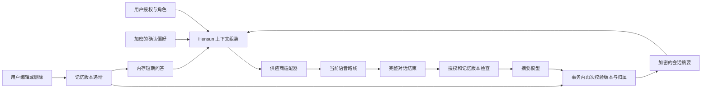

# ADR 0008：可撤回、与模型解耦的记忆

- 日期：2026-09-09。
- 状态：接受设计；本批实现并发失效保护，其余未完成项见下表。不是生产放行。
- 延续 ADR 0002 的数据最小化、ADR 0005 的角色配置、ADR 0006 的语音路线边界。

## 产品规则

记忆归属账户下的使用档案和角色，不归属板子、音色或供应商。相同角色更换支持记忆的模型时继续使用原记忆；不同角色默认不共享。设备转售不转移原账户记忆。跨角色共享以后必须由用户明确选择，当前不增加公共记忆池。

| 层次 | 内容及来源 | 生命周期与权限 |
|---|---|---|
| 短期对话 | 当前逻辑会话内完整问答，最多10组并受输入预算限制 | 只在网关内存；角色/档案切换、结束或记忆版本变化后清空。不因开启长期记忆而保存全文 |
| 已确认偏好 | 用户在网页保存/修改的称呼、偏好、备注 | 角色授权开启后加密保存，可查看、编辑、导出、删除；不得由模型摘要静默升级成已确认事实 |
| 会话摘要 | 用户授权后由摘要模型生成的简短回顾 | 与已确认偏好分开储存和标记，允许纠错；不当成可靠事实、权限或执行指令 |
| 提醒任务 | 用户明确确认的时间、时区、周期与内容 | 应属于独立任务表和调度流程。摘要里写“明天开会”不代表已创建提醒；本项目当前不据此承诺定时播报 |

自动摘要只能概括用户明确表达的偏好和事项，不根据口气推断健康、身份、关系或性格标签。引用、玩笑、否定与过期计划不能直接确认为长期偏好。自动提取为结构化偏好若以后启用，需经过候选→用户确认→正式保存流程；当前保持人工确认入口。

“关闭记忆”沿用现有行为：删除角色已保存偏好及摘要，并停止新增。再次开启只记新会话。“清空全部”清除当前账户各类记忆，但不关闭后续记忆授权，也不删除计费和会话元数据。单条删除只删除选中记录，不宣称能从所有旧摘要中识别并抹掉同一事实；彻底清除使用全部清空。

## 调用与检索

继续使用已有 ContextBuilder 和 HybridMemoryRetriever，不新增向量库或记忆平台。当前检索是中文二元词/英文词匹配、类别和时间排序，不是向量语义检索。默认选最多6条确认偏好和3条摘要；摘要候选为最近10条。输入目标7200、硬上限8000均为项目估算token，不能声称与所有供应商分词器完全一致。

用户当前明确纠正 > 最新已确认偏好 > 自动摘要；缺少依据时询问，不编造“我记得”。偏好和摘要均是非可信背景数据，其中出现的命令不能授予工具权限。现有上下文已有此提示约束；真实模型对纠错、否定和提示注入的遵循仍需独立评测。

串联路线和支持上下文的豆包路线由同一层提供材料；阿里托管应用当前不接受Hensun记忆，网页应保持能力提示，不能宣称三条路线效果一致。端到端路线在用户语音识别前组装上下文时缺少当前文本问题，相关性检索能力较弱，应单独测命中率。

摘要供应商独立于说话供应商，网页已有提示。未来换摘要模型只更换服务端适配器与配置；保留数据结构，不要求用户迁移记忆。不得将语音模型ID直接当成任意摘要供应商兼容的模型ID。

## 删除与并发：本批实现

`Agent.memory_epoch` 是单调递增的记忆版本，与更换音色等配置版本分离。网页编辑偏好、编辑/删除摘要、删除偏好、清空账户记忆、设置角色记忆授权时，在同一个数据库事务先递增记忆版本，再完成数据变更。

摘要任务携带会话开始时的版本。生成前检查版本；写入前对角色行执行带版本、归属和授权条件的UPDATE并持有数据库行锁至提交。删除先提交则旧任务无法写入；摘要先提交则后续删除事务将其删除。不依赖单进程Python锁，可用于分开的控制面和网关。

条件UPDATE使用匹配行数判定，依据[SQLAlchemy rowcount文档](https://docs.sqlalchemy.org/en/20/tutorial/data_update.html#getting-affected-row-count-from-update-delete)。本批运行SQLite；目标MySQL的实际锁等待、死锁及驱动行为仍需部署前验证，不以文档代替实测。

下一轮发现记忆版本变化，结束旧逻辑会话并清空短期问答；旧会话的摘要任务同样因版本过期被拒绝。单个摘要仍有session_id唯一约束，不重复创建。设备已不属于原用户时，迟到摘要也被拒绝。

已发送给供应商的请求无法靠本地删除撤回；当前正在播放的一轮也不会因此被本批中途停止。删除的即时含义是本地事务完成、后续旧摘要不能重新写入，下一轮不再使用旧短期上下文。若产品要求按下删除即停止正在生成/播放的回复，应接已有Outbox取消联动并另验，不将它写成当前能力。

## 上线前还需完成的明确边界

| 项目 | 决定与验收要求 | 当前状态 |
|---|---|---|
| 存储增长 | 首版建议每角色最多200条确认偏好，自动摘要保留30天；数量和期限由服务端产品策略配置。超限拒绝新增偏好并提示整理，摘要定期清理 | 未实施配额/TTL；现有偏好查询仍读取全部，当前只限制送入模型的数量 |
| 删除后恢复 | 备份恢复必须重放删除清单再开放流量；清单只含记录/账户标识、删除范围与版本，不含内容。版本保留至少覆盖最长备份周期 | 未实施删除清单和恢复演练；不能保证恢复旧备份后仍已忘记 |
| 加密密钥 | 复用现有服务端加密；零售前增加密文密钥版本和轮换演练，服务密钥与数据库备份分开 | 当前单一主密钥，未完成轮换演练 |
| 供应商超时与费用 | 摘要使用独立超时/并发/用量记录，失败不阻塞正常说话；原文不为重试而落库 | 当前后台任务生成，不保证进程崩溃后补齐；专属费用及资源门禁待补 |
| 旧设备记忆 | 新开发只使用角色记忆。旧MemorySummary保留兼容，账户清空仍涵盖它；迁移需核对归属，不自动把未知旧记录送进新角色上下文 | 兼容接口仍存在，旧接口授权与导出范围需专门收口 |
| 家庭模式 | 档案撤权同样需要版本失效保护和删除语义 | 家庭模式保持关闭，本批不作为其放行证据 |
| 海外 | 独立区域数据库、凭据及备份；国内记忆不自动迁移。迁移须用户主动导出/导入并重做权限校验 | 只确定边界，不新增空区域实现 |

先用固定中文评测集覆盖称呼、同音词、纠正、否定、玩笑、跨角色隔离、删除后询问和提示注入，并分别测每种路线。每条样本记录应使用的记忆ID和禁止使用的记忆ID；记录命中率、错误记忆率、延迟及摘要费用。没有真模型评测结果前不声称“记忆准确”。只有测得现有检索明显不足时，再引入有来源ID、权限过滤和删除传播的向量索引。

## 迁移与回退

迁移 `20260909_11` 给已有角色新增非空memory_epoch，默认0，不改角色、授权或原内容。先在隔离数据库演练，再安排控制面和网关同时升级；旧网关不识别版本，不能在混合版本运行期间宣称删除保护有效。本轮没有迁移日常数据库或重启服务。

回退保留新增列和现有数据，禁止恢复旧数据库覆盖用户新数据。若必须回退到没有版本保护的代码，应暂停摘要写入并完成旧任务清理；不能通过降级列恢复一个已不安全的写入窗口。downgrade仅用于隔离迁移演练，不作为生产默认回退步骤。
