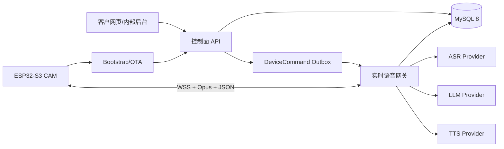

# Hensun AI 自有网关与控制台架构

## 目标

Hensun Desk 使用同一代码仓库中的两个独立 ASGI 进程：控制面负责账户、智能体、设备、配置、额度、OTA 和审计；实时网关负责设备 WSS、音频流、AI 编排、打断和表情事件。两者共享 MySQL 8，但不共享进程内状态。

首版面向 Hensun 单品牌与 1000 台以内设备，不引入 Redis 或微服务。需要第二个实时网关实例时，再把数据库 Outbox 替换为 Redis Streams，并增加分布式在线路由。

## 运行边界

- `backend.app.main:app`：控制面，默认不接收设备语音长连接。
- `backend.realtime.main:app`：实时网关，只暴露健康检查和设备 WSS。
- `backend.app.main:create_app(include_device_gateway=True)`：本地开发与兼容测试使用的组合模式。
- `web/`：Next.js + TypeScript 客户控制台和按角色隔离的内部后台。

## 数据与隐私

- 原始音频和逐句对话只存在当前连接内存，完成、打断或失败后释放。
- `ConversationSession` 只保存设备、智能体、轮数、延迟、成本和结束原因。
- 用户主动开启智能体记忆后，才保存加密的摘要与偏好；支持查看、修改和删除。
- Provider 密钥只从服务端环境变量读取，模型预设只保存逻辑路由和模型名。
- 管理操作、设备认领、配置变更、OTA 和售后操作写入审计日志。
- 实时网关周期性回收心跳过期的设备连接和孤立会话，控制台在线数只统计有效心跳。
- Provider 用量按 ASR 时长、LLM Token 估算和 TTS 字符数计入目录价成本，同时区分错误与自动降级。

## 稳定接口

- 设备协议兼容小智 `hello/listen/abort/stt/llm/tts/mcp/system/alert` 语义。
- `AsrProvider`、`LlmProvider`、`TtsProvider` 隔离具体服务商。
- `EmotionRouter` 把设备状态、ASR 用户情绪和安全类别映射到 Hensun 60 状态表情。
- `DeviceCommand` 是控制面到实时网关的事务 Outbox。
- 摄像头固件能力保留；云端视觉接口首版返回未启用，不上传图像。

## 演进门槛

- 两个以上实时网关实例或远程命令延迟超过 2 秒：引入 Redis Streams。
- 50 路以上同时语音或转码 CPU 持续超过 65%：拆出媒体工作池。
- 用量事件超过一千万行：按月分区和归档。
- 设备超过 1000 台或出现独立团队：再拆设备、AI 编排与 OTA 服务。
